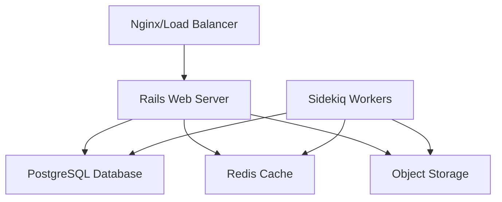

# Self-Hosting Overview

Chatwoot can be self-hosted on your own infrastructure, giving you complete control over your data, customization, and deployment environment. This guide covers everything you need to know to deploy and maintain your own Chatwoot instance.

## Why Self-Host?

- **Data Privacy**: Keep all your customer data on your own servers
- **Customization**: Full access to modify and extend Chatwoot
- **Cost Control**: Pay only for infrastructure, no per-seat pricing
- **Compliance**: Meet specific regulatory requirements
- **Integration**: Direct access to databases and services

## System Requirements

### Minimum Requirements

- **CPU**: 2 cores
- **RAM**: 4GB
- **Storage**: 40GB SSD
- **OS**: Ubuntu 20.04 LTS, 22.04 LTS, or 24.04 LTS

### Recommended Requirements (Production)

- **CPU**: 4+ cores
- **RAM**: 8GB+
- **Storage**: 100GB+ SSD
- **OS**: Ubuntu 22.04 LTS or 24.04 LTS

### Software Dependencies

- **Ruby**: 3.4.4
- **Node.js**: 24.x
- **PostgreSQL**: 16+ with pgvector extension
- **Redis**: 7.0+
- **Nginx**: Latest stable (for production)

## Deployment Options

### 1. Linux VM (Recommended for Production)

Deploy on a single Linux server using the automated installation script.

- **Best for**: Production deployments, small to medium teams
- **Complexity**: Low
- **Setup time**: 15-30 minutes
- [Deploy on Linux VM →](/self-hosting/linux-vm)

### 2. Docker & Docker Compose

Quickest way to get started with Chatwoot using containers.

- **Best for**: Development, testing, containerized environments
- **Complexity**: Low
- **Setup time**: 10 minutes
- [Deploy with Docker →](/self-hosting/docker)

### 3. Heroku

One-click deployment to Heroku's platform.

- **Best for**: Quick demos, small teams, managed infrastructure
- **Complexity**: Very Low
- **Setup time**: 5 minutes
- [Deploy to Heroku →](/self-hosting/heroku)

### 4. DigitalOcean

Deploy using DigitalOcean's one-click app or droplet.

- **Best for**: Easy cloud deployment with managed services
- **Complexity**: Low
- **Setup time**: 10-15 minutes
- [Deploy on DigitalOcean →](/self-hosting/digital-ocean)

### 5. Kubernetes

Deploy on Kubernetes using Helm charts for scalable production workloads.

- **Best for**: Large teams, high availability, auto-scaling
- **Complexity**: High
- **Setup time**: 1-2 hours
- [Deploy on Kubernetes →](/self-hosting/kubernetes)

## Architecture Overview

Chatwoot consists of several components:



### Core Components

1. **Web Server**: Rails application serving the API and frontend
2. **Background Workers**: Sidekiq workers for async jobs
3. **PostgreSQL**: Primary database with pgvector for AI features
4. **Redis**: Cache and job queue
5. **Object Storage**: For file uploads (local or S3-compatible)

## Deployment Modes

### Full Deployment (Default)

Runs both web server and background workers on the same instance.

```bash
cwctl --install
```

### Web-Only Deployment

Runs only the web server (for auto-scaling groups).

```bash
cwctl --install --web-only
```

### Worker-Only Deployment

Runs only background workers (for auto-scaling groups).

```bash
cwctl --install --worker-only
```

### Converting Between Modes

You can convert existing deployments:

```bash
# Convert to web-only
cwctl --convert web

# Convert to worker-only
cwctl --convert worker

# Convert to full deployment
cwctl --convert full
```

## Environment Configuration

Chatwoot uses environment variables for configuration. Key variables include:

```bash
# Application
SECRET_KEY_BASE=<secure-random-string>
FRONTEND_URL=https://your-domain.com
RAILS_ENV=production

# Database
POSTGRES_HOST=localhost
POSTGRES_USERNAME=chatwoot
POSTGRES_PASSWORD=<password>

# Redis
REDIS_URL=redis://localhost:6379
REDIS_PASSWORD=<password>

# Email
MAILER_SENDER_EMAIL=Chatwoot <support@your-domain.com>
SMTP_ADDRESS=smtp.your-provider.com
SMTP_PORT=587
SMTP_USERNAME=<username>
SMTP_PASSWORD=<password>

# Storage (optional)
ACTIVE_STORAGE_SERVICE=local  # or 's3'
S3_BUCKET_NAME=<bucket>
AWS_ACCESS_KEY_ID=<key>
AWS_SECRET_ACCESS_KEY=<secret>
AWS_REGION=<region>
```

See the [Environment Variables](/self-hosted/configuration/environment-variables) guide for the complete list.

## Post-Installation Steps

### 1. Create Your Account

Visit your Chatwoot URL and create the first admin account:

```
https://your-domain.com
```

### 2. Configure Email

Set up SMTP settings in your `.env` file to enable email notifications.

### 3. Set Up SSL

For production deployments, always use HTTPS:

```bash
cwctl --ssl
```

### 4. Configure Storage

For production, use S3-compatible storage instead of local storage.

### 5. Set Up Monitoring

Configure APM and error tracking (Sentry, NewRelic, Scout, etc.).

## Maintenance & Operations

### Accessing Rails Console

```bash
cwctl --console
```

### Viewing Logs

```bash
# Web server logs
cwctl --logs web

# Worker logs
cwctl --logs worker
```

### Restarting Services

```bash
cwctl --restart
```

### Upgrading Chatwoot

```bash
# Upgrade to latest stable
cwctl --upgrade

# Upgrade to specific branch (experimental)
cwctl --Upgrade develop
```

## Backup & Recovery

### Database Backup

```bash
pg_dump -U chatwoot chatwoot_production > backup.sql
```

### Restore Database

```bash
psql -U chatwoot chatwoot_production < backup.sql
```

### Backup File Uploads

If using local storage:

```bash
tar -czf uploads-backup.tar.gz /home/chatwoot/chatwoot/storage
```

## Security Best Practices

1. **Use Strong Passwords**: Set secure passwords for database and Redis
2. **Enable Firewall**: Only expose necessary ports (80, 443)
3. **Regular Updates**: Keep Chatwoot and system packages updated
4. **SSL/TLS**: Always use HTTPS in production
5. **Backup Regularly**: Automate daily database backups
6. **Monitor Logs**: Set up log monitoring and alerting
7. **Restrict Access**: Use VPN or IP whitelisting for admin access

## Performance Optimization

### Scaling Web Servers

Deploy multiple web-only instances behind a load balancer:

1. Set up a load balancer (Nginx, HAProxy, or cloud LB)
2. Deploy multiple web-only instances
3. Point all instances to shared PostgreSQL and Redis

### Scaling Workers

Deploy dedicated worker instances:

1. Deploy worker-only instances
2. Adjust `SIDEKIQ_CONCURRENCY` based on available resources
3. Monitor queue depth and add workers as needed

### Database Optimization

- Use connection pooling
- Enable query caching
- Regular VACUUM and ANALYZE operations
- Consider read replicas for high traffic

## Troubleshooting

### Common Issues

**Installation fails midway**

Check logs at `/var/log/chatwoot-setup.log`

**Database connection errors**

Verify PostgreSQL is running and credentials are correct:

```bash
sudo systemctl status postgresql
psql -U chatwoot -h localhost
```

**Redis connection errors**

Verify Redis is running:

```bash
sudo systemctl status redis-server
redis-cli ping
```

**Assets not loading**

Recompile assets:

```bash
sudo -i -u chatwoot
cd chatwoot
RAILS_ENV=production rake assets:precompile
```

## Getting Help

- **Community Forum**: [chatwoot.com/community](https://chatwoot.com/community)
- **GitHub Issues**: [github.com/chatwoot/chatwoot/issues](https://github.com/chatwoot/chatwoot/issues)
- **Documentation**: [chatwoot.com/docs](https://www.chatwoot.com/docs)

## Next Steps

Choose your deployment method:

- [Docker Deployment →](/self-hosting/docker)
- [Heroku Deployment →](/self-hosting/heroku)
- [DigitalOcean Deployment →](/self-hosting/digital-ocean)
- [Kubernetes Deployment →](/self-hosting/kubernetes)
